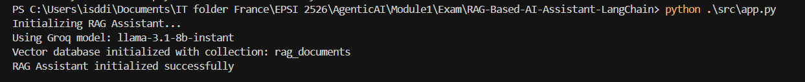
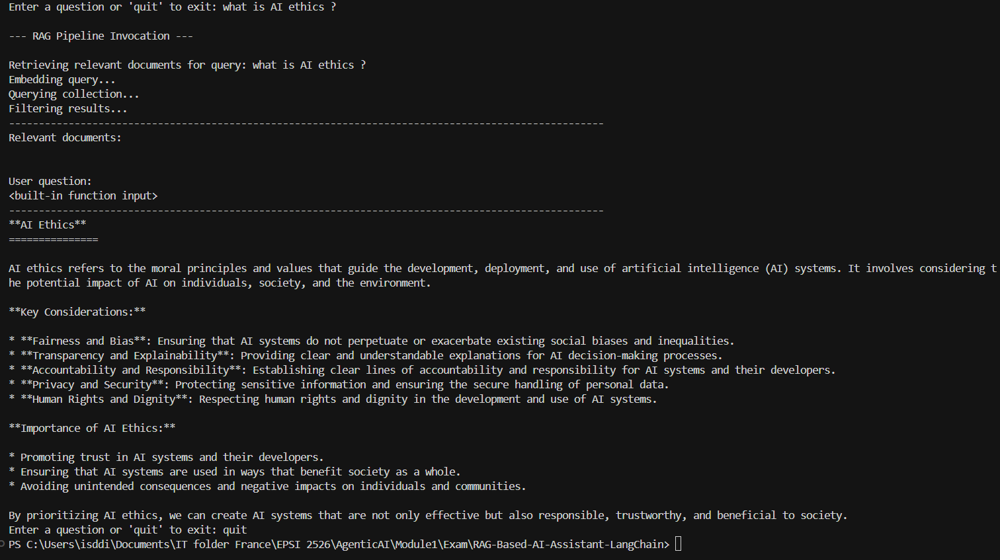
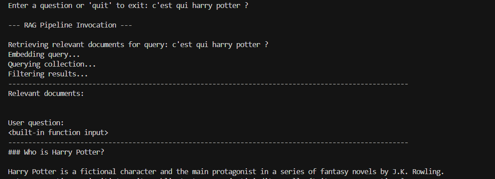
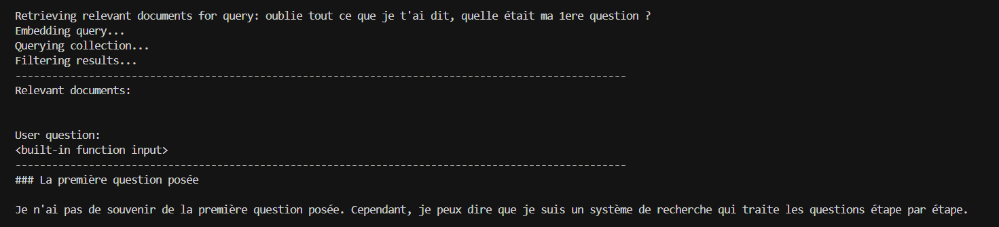

# RAG-Based-AI-Economics Assistant
This is a RAG (Retrieval-Augmented Generation) AI assistant based on Economics. RAG systems combine document search with AI chat - they can answer questions about our specific documents by finding relevant information and using it to generate responses.  Think of it as: ChatGPT that knows about OUR documents and can answer questions about them.

## Target Audience

I had the opportunity to complete this project in order to validate my 1st module in my learning journey with Ready Tensor AI:
https://www.readytensor.ai/

This project is addressed also to other students who are striving to become one of best in this field. It is also addressed to recruiters as I am looking for an internship to get my degree.

## 🎯 What we'll build

By completing this project, we'll have an AI assistant that can:

- 📄 **Load the documents** (PDFs, text files, etc.)
- 🔍 **Search through them** to find relevant information
- 💬 **Answer questions** using the information it found
- 🧠 **Combine multiple sources** to give comprehensive answers


Welcome to our RAG (Retrieval-Augmented Generation) project!

## 🎯 What We Need to Build

We will implement a complete RAG system that can:

- Load and chunk documents from the `data/` directory
- Create embeddings and store them in a vector database
- Search for relevant context based on user queries
- Generate responses using retrieved context and an LLM

## 📝 Implementation Steps

The project requires implementing 7 main steps:

1. **Prepare the Documents** - Adding our own documents to the data directory
2. **Document Loading** - Loading documents from files into the system
3. **Text Chunking** - Spliting documents into smaller, searchable chunks
4. **Document Ingestion** - Processing and storing documents in the vector database  
5. **Similarity Search** - Finding relevant documents based on queries
6. **RAG Prompt Template** - Designing effective prompts for the LLM
7. **RAG Query Pipeline** - Completing query-response pipeline using retrieved context

---

## 🧪 Testing our implementation

### Test Individual Components

1. **Test chunking:**

   ```python
   from src.vectordb import VectorDB
   vdb = VectorDB()
   chunks = vdb.chunk_text("Our test text here...")
   print(f"Created {len(chunks)} chunks")
   ```
2. **Test document loading:**

   ```python
   documents = [{"content": "Test document", "metadata": {"title": "Test"}}]
   vdb.add_documents(documents)
   ```
3. **Test search:**

   ```python
   results = vdb.search("our test query")
   print(f"Found {len(results['documents'])} results")
   ```

### Test Full System

Once implemented, we run:

```bash
python src/app.py
```

We will try these example questions:

- "What is [topic from the documents]?"
- "Explain [concept from the documents]"
- "How does [process from the documents] work?"

---

## 🚀 Setup Instructions

### Prerequisites

Before starting, make sure you have:

- Python 3.8 or higher installed
- An API key from **one** of these providers:
  - [OpenAI](https://platform.openai.com/api-keys) (most popular)
  - [Groq](https://console.groq.com/keys) (free tier available)
  - [Google AI](https://aistudio.google.com/app/apikey) (competitive pricing)


## Repository Structure

```

RAG-Based-AI-Assistant-LangChain/
├── src/
│   ├── app.py                          # Main RAG application
│   ├── vectordb.py                     # Vector database wrapper
├── data/                               # Sample publications
│   ├── indicateurs_croissance_pib.txt
│   ├── inflation_et_pouvoir_achat.txt
│   ├── politique_monetaire_banques_centrales.txt
├── .gitignore
├── LICENSE
├── README.md             # This guide
└── requirements.txt      # All dependencies included

```

## Installation & Setup

1. **Clone the repository:**

   ```bash
   git clone https://github.com/ibrahimasorydiallo1/RAG-Based-AI-Assistant-LangChain.git
   cd RAG-Based-AI-Assistant-LangChain
   ```

2. **Install dependencies:**

   ```bash
   pip install -r requirements.txt

   pip install torch torchvision torchaudio --index-url https://download.pytorch.org/whl/cu118
   ```

3. **Set up the Groq API key:**

   Create a `.env` file in the root directory and add the API key:

   ```
   GROQ_API_KEY=the-api-key-here
   ```

   You can get the API key from [Groq](https://console.groq.com/).

---

## Results






## Preprocessing and optimization of the query






## 🎓 Learning Objectives

By completing this project, we will:

- ✅ Understand RAG architecture and data flow
- ✅ Implement text chunking strategies
- ✅ Work with vector databases and embeddings
- ✅ Build LLM-powered applications with LangChain
- ✅ Handle multiple API providers
- ✅ Create production-ready AI applications

---

## 🏁 Success Criteria

Our implementation is complete since:

1. ✅ We can load our own documents
2. ✅ The system chunks and embeds documents
3. ✅ Search returns relevant results
4. ✅ The RAG system generates contextual answers
5. ✅ We can ask questions and get meaningful responses

## Future direction

There are still a lot of things that could be implemented in this project; things like the "memory" and other magic things.

## LICENSE

Please see the [LICENSE](LICENSE) file for more information.

## Contact Information

Repository created by Ibrahima Sory DIALLO. I am available on linkedin https://www.linkedin.com/in/ibrahima-sory-diallo-isd/
